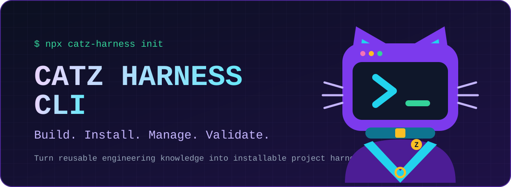
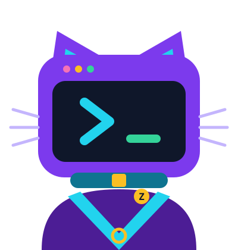

<p align="center">
  
</p>

<p align="center">
  <a href="https://www.npmjs.com/package/catz-harness"></a>
  <a href="https://github.com/kyumw3b/CATZHarnessCLI/actions/workflows/ci.yml"></a>
  
  <a href="LICENSE"></a>
  
</p>

<p align="center">
  <strong>The project-local installer and workspace manager for reusable CATZ engineering harnesses.</strong>
</p>

> [!IMPORTANT]
> **Security update:** npm `v0.1.0` has a known symlink/junction workspace-boundary weakness when used inside a maliciously prepared repository. `v0.1.1` hardens filesystem containment and is the current source target. Until `v0.1.1` is published, avoid running `v0.1.0` in untrusted repositories.

<p align="center">
  <a href="#why-catz">Why CATZ</a> ·
  <a href="#how-it-works">How It Works</a> ·
  <a href="#quick-start">Quick Start</a> ·
  <a href="#commands">Commands</a> ·
  <a href="#harnesses">Harnesses</a> ·
  <a href="#safety-by-design">Safety</a> ·
  <a href="#roadmap">Roadmap</a>
</p>

---

## Why CATZ



Engineering knowledge often ends up scattered across prompts, checklists, Markdown files, repositories, and personal workflows. That makes good practices difficult to reuse consistently from one project to the next.

**CATZ turns reusable engineering guidance into project-local harnesses that can be installed, tracked, validated, and removed through one predictable CLI.**

The CLI keeps the workspace explicit: CATZ state lives inside the project, the manifest is the source of truth, and diagnostics are read-only.

CATZ is being built as an open-source engineering harness ecosystem. This repository provides the command-line layer that manages those harnesses.

<br clear="right">

## How It Works

Three commands are enough to understand the core workflow.

### 1. Initialize

```bash
npx catz-harness init
```

Creates a project-local CATZ workspace.

### 2. Install a harness

```bash
npx catz-harness harness add presentation
```

Adds the harness to `.catz/harnesses/` and registers its version in the workspace manifest.

### 3. Validate

```bash
npx catz-harness harness doctor
```

Checks the runtime, workspace, manifest, harness directories, metadata, names, and versions without repairing or rewriting state.

## Quick Start

No global installation is required.

```bash
npx catz-harness --version
npx catz-harness init
npx catz-harness harness add presentation
npx catz-harness harness list
npx catz-harness harness doctor
npx catz-harness harness remove presentation
npx catz-harness harness list
```

CATZ creates a small, visible workspace inside the current project:

```text
your-project/
└── .catz/
    ├── catz.json
    └── harnesses/
        └── presentation/
            └── harness.json
```

## Commands

| Command | Purpose |
| --- | --- |
| `catz init` | Initialize a CATZ workspace without overwriting an existing manifest. |
| `catz harness add <name>` | Install a supported harness and register its version. |
| `catz harness list` | List harnesses registered in `.catz/catz.json`. |
| `catz harness remove <name>` | Remove a registered harness only after CATZ proves the target remains inside its verified workspace boundary. |
| `catz harness doctor` | Run read-only health checks across the workspace and installed harnesses. |

### Workspace manifest

The workspace manifest is the source of truth for installed state:

```json
{
  "version": 1,
  "harnesses": {
    "presentation": {
      "version": "0.1.0"
    }
  }
}
```

## Harnesses

### Available in v0.1.0

`presentation` is the built-in installable harness name used by the first public CLI release.

> [!NOTE]
> **v0.1.0 integration status:** `presentation` currently installs a built-in fixture used to validate the CLI contract. The full CATZ PowerPoint Presentation Harness is not bundled in this release; it will replace the fixture in a later integration step.

### CATZ ecosystem direction

The broader CATZ ecosystem is designed around reusable engineering harnesses for areas such as:

- PowerPoint presentation workflows
- product requirements
- architecture
- UI/UX
- frontend engineering
- backend and business logic
- API contracts
- databases
- security
- software testing and QA

These ecosystem projects are not automatically installable through the CLI unless they are explicitly integrated and supported by the current release.

## Safety by Design

CATZ keeps its behavior small and predictable. The `v0.1.1` source target adds explicit filesystem-boundary hardening after the first public security audit.

- **Verified filesystem containment** — write/delete operations reject symlinked or junction CATZ paths and fail closed when containment cannot be proven.
- **Project-local state** — managed paths are verified against the current project before filesystem mutation.
- **Manifest-based state** — `.catz/catz.json` is the source of truth for installed harnesses.
- **Idempotent operations** — repeated initialization, installation, and removal are handled safely.
- **Validated manifest data** — harness names and versions reject unsafe/control-character payloads before terminal output or mutation.
- **Read-only diagnostics** — `catz harness doctor` reports problems without repairing or rewriting files, including redirected/symlinked workspace paths.
- **Cross-platform verification** — CI runs on Windows and Ubuntu with Node.js 20 and 22.
- **Adversarial filesystem tests** — the `v0.1.1` source target covers symlink/junction escapes and terminal-control manifest payloads.
- **Release-tested** — the public `0.1.0` package passed the original clean-room `npx` lifecycle; the security patch will receive a new clean-room acceptance run before publication.

## Roadmap

| Stage | Status |
| --- | --- |
| CLI executable and command routing | ✅ Complete |
| `catz init` | ✅ Complete |
| `catz harness add` | ✅ Complete |
| `catz harness list` | ✅ Complete |
| `catz harness remove` | ✅ Complete |
| `catz harness doctor` | ✅ Complete |
| npm / npx distribution | ✅ Complete |
| CATZ Harness CLI `v0.1.0` | ✅ Released |
| Security Patch `v0.1.1` — filesystem boundary hardening | 🛡️ In validation |
| Full PowerPoint Presentation Harness integration | ⏸️ Paused until `v0.1.1` |

The current focus is completing and publishing the `v0.1.1` security patch. Full PowerPoint Presentation Harness integration remains paused until the hardened CLI passes CI, package verification, and a clean-room security acceptance test.

## Requirements

- Node.js 20 or newer
- npm / npx

## Development

<details>
<summary><strong>Local development and package verification</strong></summary>

### Install dependencies

```bash
npm ci
```

### Run the test suite

```bash
npm test
```

The `v0.1.1` source target contains **45 passing tests**, including adversarial filesystem and manifest-safety coverage.

### Link the CLI locally

```bash
npm link
catz --version
catz --help
```

### Inspect the npm package

```bash
npm pack --dry-run
npm pack
```

The published package intentionally ships compiled `dist/` output plus npm's automatically included package metadata, README, and license. Source files and tests are not included in the npm tarball.

</details>

## Release

Current public package:

```text
catz-harness@0.1.0
```

Current source target:

```text
catz-harness@0.1.1
```

Run it directly with:

```bash
npx catz-harness init
```

## License

Released under the [MIT License](LICENSE).

---

<p align="center">
  
</p>

<p align="center">
  <strong>CATZ Harness CLI</strong><br>
  Build. Install. Manage. Validate.
</p>
